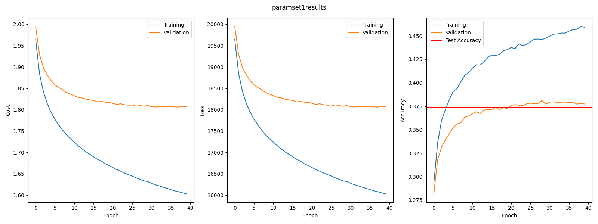
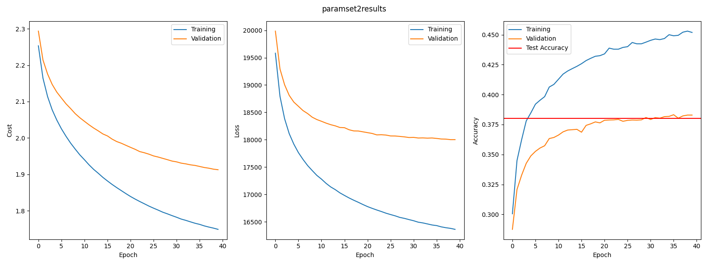
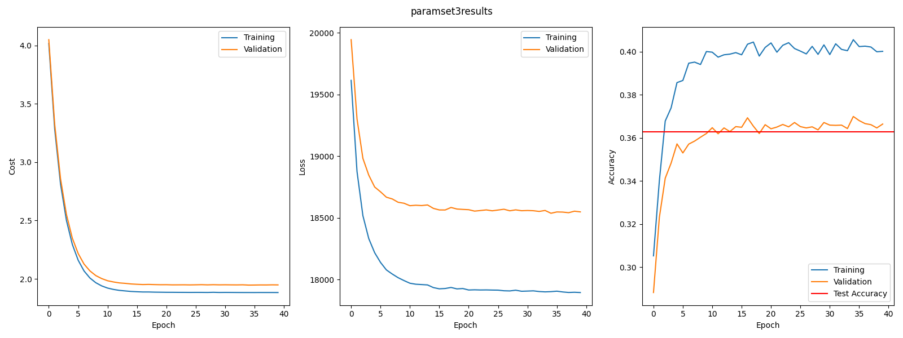
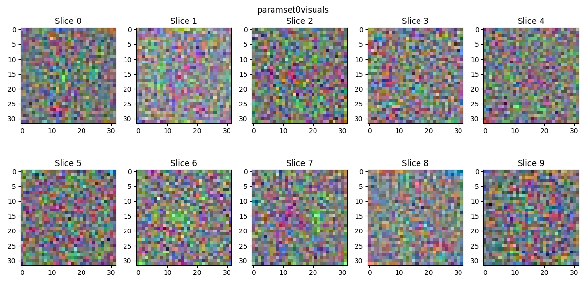
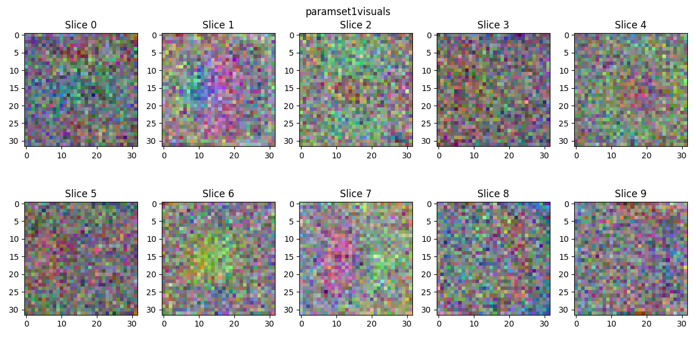

# Assignment 1

I successfully managed to implement the analytical gradient calculation along with the other functions mandated by the assignment.

To test whether the analytical gradient was implemented correctly, I implemented the ```LinearLayer.relerr()``` method which calculates the relative error between gradients as described on page 8 in the assignment instructions.

Upon to test the quality of the analytical gradient I ran these calculations on a submatrix with 20 columns due to the slow nature of the numerical evaluation.

This yielded a relative error in gradients for W and b of:

| Parameter | Relative Error          |
|-----------|-------------------------|
| W         | 2.110e-08  |
| b         | 1.748e-08  |

In otherwords, a really small error, so it is safe to assume the analytical gradient is good.

Now we proceed to run the full training and evaluate the results.

## Results

We run the training for the following parameter sets:

| Set | Lambda | N Epochs | N Batch | Eta   |
|-----|--------|----------|---------|-------|
| 0   | 0      | 40       | 100     | 0.1   |
| 1   | 0      | 40       | 100     | 0.001 |
| 2   | 0.1    | 40       | 100     | 0.001 |
| 3   | 1      | 40       | 100     | 0.001 |

See the training and validation results for each of the paramater sets below:




For parameter set 0 and 1, the only difference in hyper parameter is the much higher learning rate of set 0. It is clear from the above results that this higher learning rate results in overfitting, with training accuracy far exceeding validation accuracy. Not only this, it doesn't seem to converge properly, it is too numerically unstable due to the large step-size.

In set 1 on the other hand, the much smaller step size leads to a much smoother training, seemingly converging (not enough epocs to see the asymptote), and significantly less overfitting, with a small gap between training and validation accuracy.



With the introduction of regularization we see a closing of the gap between the cost and loss of training and validation data, suggesting that it reduces overfitting. Additionally, it seems from the accuracy that the model does generalize better, and with more potential, since the accuracy increase looks linear, without signs of a plateau.



The same conclusions can be drawn for further increasing the regularization, except now it does seem to enourage fast convergence, we see that cost, loss and accuracy all seemingly converge around the 15th epoch.

The final test accuracy is visible in each of the above images, but for good measure here is a numerical overview:

| Set | Test Accuracy |
|-----|---------------|
| 0   | 0.2828        |
| 1   | 0.2712        |
| 2   | 0.3274        |
| 3   | 0.3632        |






For the leaning representations here, it seems that only with sufficiently high regularization will the linear layer learn generalizable features. For lower regularization it still seems random, and fails to capture images features. In parameter set 3 it is clear that the network has learned some sort of image features, although they are not easily interpretable.