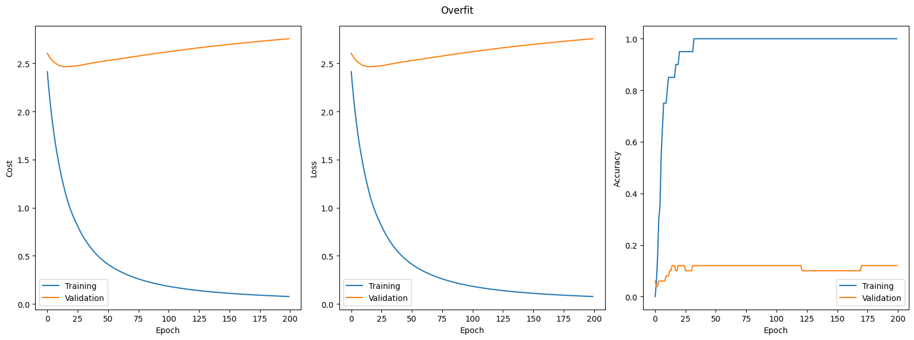
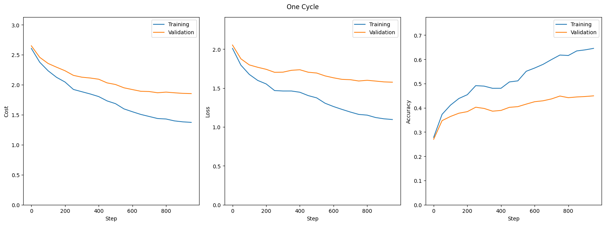
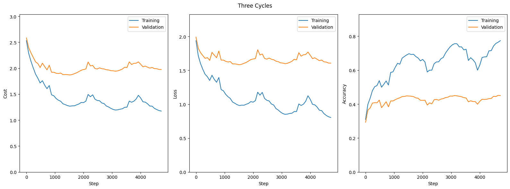
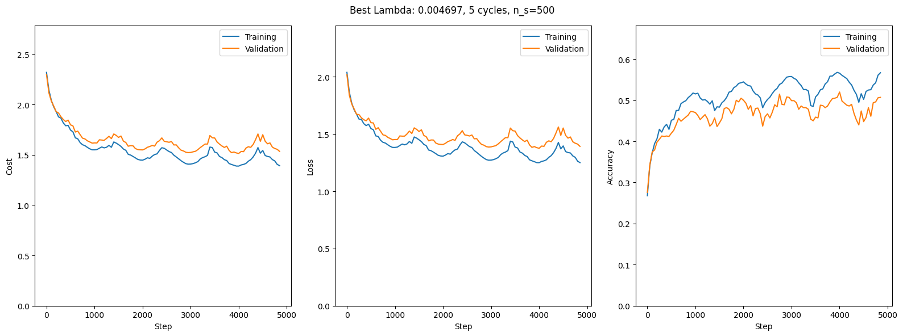

# Assignment 2

## i) Analytical Gradient Verification

Using the analytical implementation as well as the centered difference numerical implementation I calculated the relative error for each paremeter as seen in the table below:

| Parameter   | Relative Error |
|-------------|----------------|
| W1          | 2.49e-09       |
| W2          | 4.75e-10       |
| B1          | 2.08e-09       |
| B2          | 3.83e-10       |

These are very small errors, so it suggests that the implementation is valid.

Lastly we perform a sanity check by doing 200 epochs of training without regularization on a small dataset to see if we can overfit, see the figure below:

Clearly we are overfitting, strongly suggesting that the gradient descent is indeed finding a good minimum, and by extension that the gradient calculations are accurate.

## ii) Default cyclical training

Below you can see the figures describing the results of cyclical training with 1 and 3 cycles respectively.
In both cases we use the default hyperparameters:

| Parameter | Value   |
|-----------|---------|
| λ         | 0.01    |
| n_batch   | 100     |
| η_min     | 1.00e-5 |
| η_max     | 1.00e-1 |

The cycles phases are clear from the trainin curves, but notably there doesn't seem to be much to gain from running multiple cycles.
The loss does trend downwards with more cycles, but only just barely - the accuracy gain seems to be near negligible.

## iii) Coarse Lambda Search

During the coarse search we train for 2 cycles over 8 logarithmically distributed values of lambda, see the table below for lambda values and associated validation accuracies:

| Lambda       | Validation Accuracy |
|--------------|---------------------|
| 1.00e-5      | 0.511               |
| 3.73e-5      | 0.504               |
| 1.39e-4      | 0.507               |
| 5.18e-4      | 0.516               |
| 1.93e-3      | 0.517               |
| 7.20e-3      | 0.518               |
| 2.68e-2      | 0.473               |
| 0.100        | 0.386               |

We get the best performance for lambda = {7.20e-3, 1.93e-3, 5.18e-4} in that order.

The remaining hyperparameters are the same as in section ii), with the notable difference that stepsize is calculated according to the size of the training dataset as suggested in the assignment description, so here we have a stepsize of 450.

## iv) Fine Lambda Search

During the coarse search we train for 3 cycles over 10 linearly distributed values of lambda in the range between the two lambda values surrounding the optimal from the coarse search, i.e the range [1.93e-3, 2.68e-2], see the table below for lambda values and associated validation accuracies:

| Lambda   | Validation Accuracy |
|----------|---------------------|
| 0.00193  | 0.509               |
| 0.00470  | 0.522               |
| 0.00746  | 0.517               |
| 0.0102   | 0.512               |
| 0.0130   | 0.504               |
| 0.0158   | 0.503               |
| 0.0185   | 0.490               |
| 0.0213   | 0.486               |
| 0.0241   | 0.482               |
| 0.0268   | 0.473               |

Only change in hyperparameters from the coarse search is the choice of lambdas and the amount of cycles.

## v) Best Lambda

From before, we see an optimal validation performance at lambda = 0.00470.

In this final training we use 49000 samples for training, only 1000 for validation, and the rest for testing.

I opted to run 5 cycles of training with a stepsize of 500, with otherwise unchanged hyperparameter values. This yielded the below training curve:

With a final validation accuracy of 0.507, and test accuracy of 0.505.