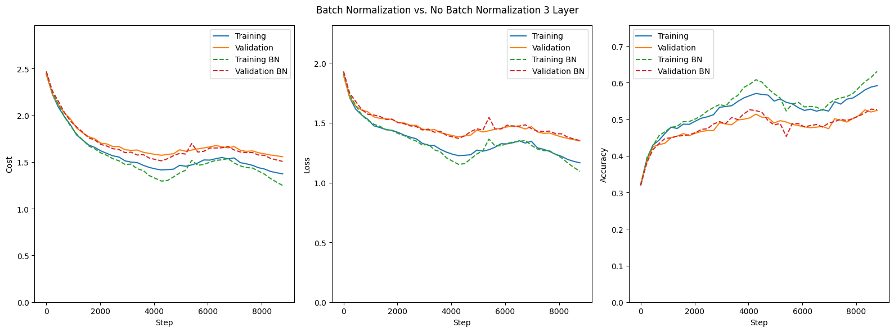
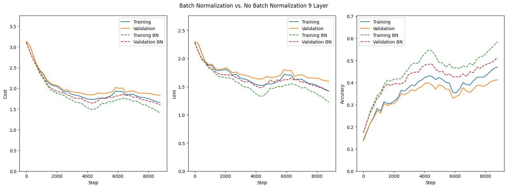
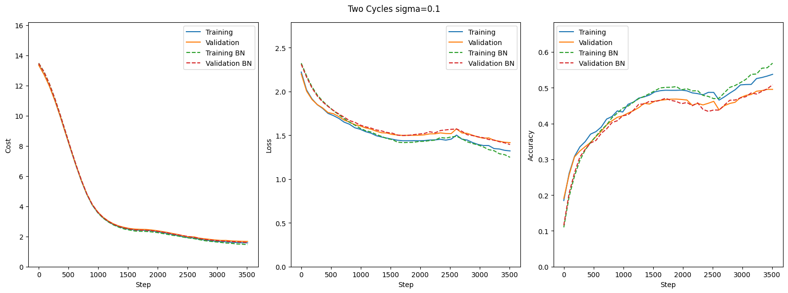
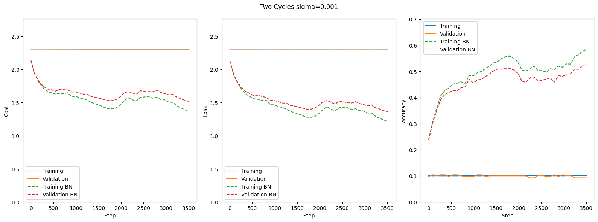

# Assignment 3

## i) Gradient verification

To check whether the gradient calculations are correct, I calculate the relative error between my analytical gradient and the numerical gradient calculation.

For a 3 layer network without batchnorm, the relative errors were:

| Layer  | Relative error W  | Relative error B  |
|--------|-------------------|-------------------|
| Layer 1| 1.04e-09          | 5.24e-10          |
| Layer 2| 5.14e-10          | 5.61e-10          |
| Layer 3| 4.11e-10          | 2.33e-10          |
| Layer 4| 4.17e-10          | 1.58e-10          |

For a 2-Layer network with batchnorm:

| Layer  | Relative error W  | Relative error B  | Relative error Beta  | Relative error Gamma |
|--------|-------------------|-------------------|----------------------|----------------------|
| Layer 0| 0.323             | 1.00              | 1.98e-10             | 1.93e-10             |
| Layer 1| 9.98e-11          | 9.02e-11          |                      |                      |

For a 3-Layer network with batchnorm:

| Layer  | Relative error W  | Relative error B  | Relative error Beta  | Relative error Gamma |
|--------|-------------------|-------------------|----------------------|----------------------|
| Layer 0| 0.412             | 1.00              | 0.557                | 0.449                |
| Layer 1| 0.412             | 1.00              | 3.17e-10             | 4.03e-10             |
| Layer 2| 9.74e-11          | 1.08e-10          |                      |                      |

It is clear that the calculations without batchnorm are very accurate, with all errors on the order of 10^(-9) or less. 

It is another story with batchnorm, only the last layer of each weight is accurate, it comes as no surprise that the errors should increase as they propagate through the network, but this is way too much, and tells me there is an error somewhere. Alas, I have been unable to find it, I gave up and decided to move on to see if the qualitative properties of the batchnorm implementation still hold water, which it would seem it does.

## ii) 3-Layer Network

From the graph below we can see that there is not a large performance difference when using batchnormalization for a 3 layer network, which is not too surprising since the network is still shallow, so the benefits of batchnorm do not get the opportunity to shine through.

For all intents and purposes, there is barely any difference here, as also supported by the testing accuracies of:

Test accuracy BN:  0.5171

Test accuracy:  0.5152

## iii) 9-Layer Network

For the deeper 9-layer network we see that batchnormalization provides a consistent performance boost throughout training. With loss and validation remaining lower, and accuracy higher than for their non-batch normalized counterparts.

This also provides some evidence that the error in my implementation likely is a minor one, since the batchnormalization de-facto works as intended. 

The final test accuracies after training are:

Test accuracy BN:  0.5015

Test accuracy:  0.4141

Clearly demonstrating the advantage batch norm provides.

## iv) Hyper Parameter Search

I performed the parameter search for the lambdas:

$\lambda = 10^l$ for 8 values of $l$ uniformly distributed between $l_{min} = -5$ and $l_{max} = -1$. Exactly like I did in my coarse search in assignment 2, allowing for a more direct comparison.

Without batch normalization, this hyperparameter search resulted in:

| Lambda  | Value     | Validation Acc no BN | Validation Acc with BN |
|---------|-----------|---------------------|---------------------|
| Lambda 0| 1.00e-05  | 0.511               | 0.508               |
| Lambda 1| 3.73e-05  | 0.504               | 0.503               |
| Lambda 2| 1.39e-04  | 0.507               | 0.506               |
| Lambda 3| 5.18e-04  | 0.516               | 0.516               |
| Lambda 4| 1.93e-03  | 0.517               | 0.521               |
| Lambda 5| 7.20e-03  | 0.518               | 0.529               |
| Lambda 6| 2.68e-02  | 0.473               | 0.513               |
| Lambda 7| 1.00e-01  | 0.386               | 0.471               |

So we get the same optimal lamda = 0.0072 in both cases, but it is clear that the validation accuracy is much more stable for higher lambdas when we use batch normalization.

Which suggests that batchnormalization improves the effectiveness of regularization.

## v) Initialization Sensitivity

Below you see figures for training of a two layer network with weights initialized with 3 different variances.

It is clearly visible that the initialization has a large effect of the training of a network without batchnormalization, with the two lower variances showing that the network without batchnormalization effectively does not learn at all, with no decrease in loss.

With a high enough variance there is little-to-no difference.

But the value of batchnormalization as a tool to prevent initialization sensitivity is clearly displayed here.