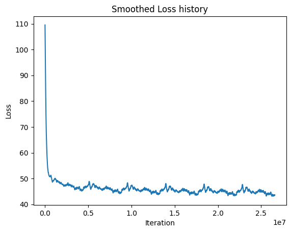

# Assignment 4

## i) Verification of gradient

I calculated, for each weight, the numerical and analytical gradient for a small network with m=5.
For each of the weights, I then calculated the relative error between the analytical and numerical gradients, which yielded:

| Weight   | Relative Error         |
|----------|------------------------|
| b        | 1.4749889309780247e-09 |
| c        | 3.147934664526794e-10  |
| U        | 2.5802235915813572e-09 |
| W        | 5.907033780816311e-08  |
| V        | 5.345316230238328e-09  |

So for all weights the relative error was less than 10^(-8), which I deemed to be sufficient evidence to move on. 

I will consider the loss graph in the next section as the final evidence that the backprop worked, since it dropped quickly, and seemed to converge to a local minimum around loss = 45.

## ii) Graph of smooth loss

Below is a plot of the smoothed loss for each iteration of 5 epochs of training.

## iii) Evolution of synthesized text

### Step: 0
XSU7CaMg	3VmV:TvtjogmvS(w}k26:f2FW?ymZS_•IüpsPh22üBjF7(Kü9gj-TSIFdeHLejZ^UBG	2OI7Rga^yqhLyCü0yhCS,lh^zsMM::a172oqEoiaZ:Qs0Vr)LUODbn2/ZxHo)pN(xGBi
iZ,fX0dHI6(gRt_ L?rymo^•u66
qF)9ixcfcmz;xx:FCüLLl}Cj!R

### Step: 10000
Arire t makrarbem. ere ats Tfeavart )ringich han the of Bfestry, the sar phacorst Harming roul caod acr.
The kyighterine to lang surcer cor's and samy to mannemexpnere" said .e. Salling," said alle, S

### Step: 20000
ins elcofingly. ."
"the net owited dit Haid wirc" saig eat and if the fid io her sayterstrink-" Satring brenmelf."
"Itk-"phem he wet," . Harry come's?"
... miin tuttre brat soubly eeplystar't er-"Teel

### Step: 30000
ewer, stoon, miretel in thear sar not whonr her youeggensoor lound was mindy's cawmen more compingion, deerel repe him ale was of a were of tand..
"Ho wat the foibed.  To fright'he on tarterstersing o

### Step: 40000
doccor; beto lrnith upellirge hich thin't torredlinged bar odernth greferught wast formor Harry walden.  And prefartem a his up tore heashers?" Harry way if was stant donche not Erlyone spumill at the

### Step: 50000
 befter cancerly'ntsed a theveds his an treard.  To Cemmough butly, wiglirld at her theng, leclle the pleplidT.
Frryed a miggly was amair, ster of a bas'ed door lig!"
Mr. pery mesmoun.  Ther whar smre

### Step: 60000
...."
Amging with hand stiand netcle will."
Armsed - alded Dee," he Durmbren.  "Lich. "Weanged he hever the ghat astwart madsent thoods, stausset nowby.  . Sncy.

She cousser, anderang -"
Thin of rump

### Step: 70000
facirs.
Harry gimblicuser, who was justed aboup, Harwy her. "Eucd Hapruslle in an candned of fiven an herr ton so been, himaeared a knoo dinns flid parmase - do as Poor caching?"
Bral him keeck fer mo

### Step: 80000
nes was comeed.
"No tinto backing.  The prealer.  He sleppoone a memuck, Elking thraDd.  He aroun of Pothere; a on the ke a demuco wand the had-st was for aedit."
"I coriegg."
"CEsnen dawk degoinabn. 

### Step: 90000
ld his a gave was surripby you lable bedcusene gram far of Poller thouch?.
		"woy....
BAong to ill phem leete.  With nair youddem dist his whutron till no rusts Quiter crady ctasp you was a fillont, a

### Step: 100000
gade.  "Weld the gooce, Harry.  "De joustreevine-led whuted of wat heang was reawly of the Dumblethe you'le!"  Hermestion - Umo.  neat ese gritilnf egoppionor Snapmed seap ysun?"
"What it tome bettatc

## iv) Best weight synthesis

Best loss: 43.1

Synthesized text for the corresponding best model weights:

he reave tis at a herselt out knsite.  The hy with Firht slew ter.  He reelfy, at hessise spint the Goold Perser," Ron word it ir as shioks.  Hogmace's as with touonedly at a very over fightly, and waines, he let me the Sido the Gey.
Bed good Hermione there dreve," he's staring a sidiso, I at the don't had and had stors Mont don't, and de my levired at Eot all rean.
"Mr he keath Harry.
"Ceflyoke?"
"Gobigue and been."
Ferting yough cuming fingled from talkes ussim.  Malfed of he was everyones, with corrizared disent poare of put yold a ner.
"I was for Been to con at the had of the Worttall said.   Daginging, lestorouse ian dourd, and it wand, and sold!  He the way hand tayed to so to got anything to med. But lins and and we the now ne toward Uncely, dundemide rookicaling thim, Harry but scared porpLon't finger mf ofgendand here-led-on.
"
"Sall one to lack eacing the Ron.
"I with him.
"I con't?"  He pround youl two to have all his lamso dark one of scate just owerce, theor she cenate her